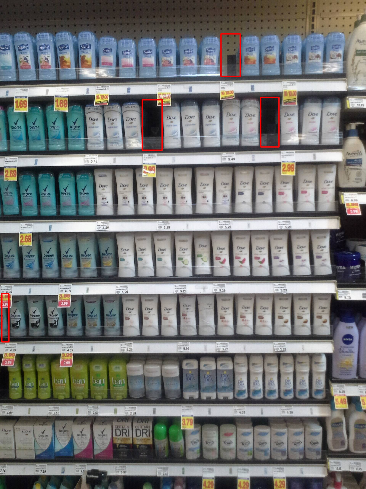

### detection_items_on_shelves

**holes_on_shelves - searching for gaps on shelves with goods**

For detecting goods on shelves, a single-stage GFL detector is used. ResNet18 is used as the backbone. The model was trained on SKU110K data, which was prepared in the COCO json format.

To search for gaps, shelves were pre-selected as polygons. To match each product's bounding box to a specific shelf, the intersection area of the bounding box with the shelf polygon was calculated. If the intersection area is greater than a set threshold, then the bounding box belongs to the shelf.

All bounding boxes were sorted. Using the coordinates of the bounding boxes, all gaps between goods were saved. To find the required gaps, the average values of the gaps by shelves and standard deviations relative to the average values of the gaps were calculated. If the width of the gap between bounding boxes does not meet the condition, then there are no goods there.

**similar_products_groups - Searching for similar goods by groups**

To search for groups of similar goods, the reid-strong-baseline model (https://github.com/michuanhaohao/reid-strong-baseline) was trained on the AliProducts dataset. Using this trained model, embeddings of the goods were obtained. The DBSCAN clustering method was then applied to these embeddings. As a result, similar goods were identified.

**wrong_position_product - searching for goods on shelves that are in the wrong place**

To solve this problem, the reid-strong-baseline model (https://github.com/michuanhaohao/reid-strong-baseline) was trained on the AliProducts dataset. Using this trained model, embeddings of the product crops were obtained. The DBSCAN clustering method was then applied to these embeddings for each designated shelf. As a result, products on the shelves that were not in their correct places were identified.

